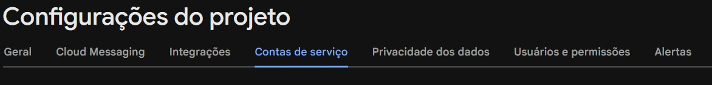
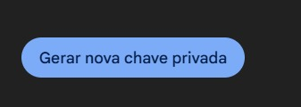
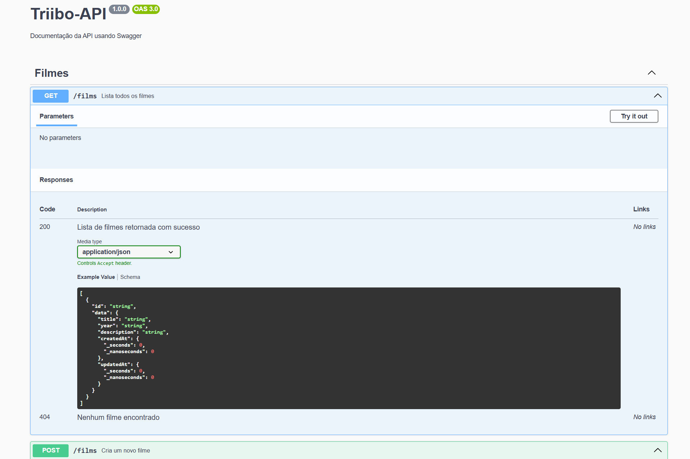

# Filmes API

API REST para gerenciamento de filmes com integração à OMDB API para detalhes.

---

## Tecnologias Utilizadas

- Node.js
- Express.js
- TypeScript
- Swagger
- Firebase Admin SDK
- Axios
- JWT Authentication
- Firestore Database

---

## Pré-requisitos

Antes de rodar a aplicação, certifique-se de ter instalado:

- **Node.js** (versão 24+)  
    https://nodejs.org/

Verifique se está tudo OK:

```sh
node -v
npm -v
```

---

## Configuração

No projeto foi deixado dois arquivos de configuração do projeto, eles se fazem necessários
para o funcionamento do projeto ```.env``` e ``firebaseKey.json``, na raíz do projeto você pode verificar exemplos de chaves necessárias. (``.env.example`` e ```firebaseKey.example.json```)

Utilize o ``.env.exemple`` para colocar as suas váriaveis de ambiente e em seguida renomeie o arquivo para ``.env``.

Siga com as instruções abaixo para configurar o Firestore/Firebase.

Caso seja necessário, abra o console do firebase em: https://console.firebase.google.com/

Abra a configuração e vá em conta de serviço: 


E em seguida clique em:



Irá ser solicitado um download de um JSON com informações parecidas com esse exemplo:
```
{
  "type": "service_account",
  "project_id": "id do projeto",
  "private_key_id": "token",
  "private_key": "PRIVATE KEY",
  "client_email": "emaildeservico.iam.gserviceaccount.com",
  "client_id": "clientid",
  "auth_uri": "https://accounts.google.com/o/oauth2/auth",
  "token_uri": "https://oauth2.googleapis.com/token",
  "auth_provider_x509_cert_url": "https://www.googleapis.com/oauth2/v1/certs",
  "client_x509_cert_url": "....servico.gserviceaccount.com",
  "universe_domain": "googleapis.com"
}

```

No entanto, utilize o arquivo de exemplo e coloque os valores de ``firebaseConfig`` dentro deles. Em seguida, delete a palavra ``.example`` do nome do arquivo e deixe somente como: ``firebaseKey.json``


---

## Instalação

Para que possa executar o projeto, é necessário que sejam instalados todas as dependências, 
para isso rode no terminal
```sh
npm install 
```
---

## Execução

### Modo DEV:
Para rodar o projeto em modo dev utilize:

```sh
npm run dev
```

### Modo PROD:
Para rodar em modo produção, gere a build do projeto:
```sh
npm run build
```
e em seguida:
```shell
npm start
```

---

## Como funciona?

A API conta com SWAGGER para criar uma rota a qual você conecta pelo navegador, utilize:
```http://localhost:PORT/docs/```, onde PORT é a variável definida no arquivo ```.env```.

Nessa rota, é possível visualizar o retorno da API e seus exemplos.

Para criar o login, utilize a rota: ``http://localhost:PORT/login/create``, no corpo da requisição passe um JSON com as chaves ``email`` e ``password``:

``
{
    "email": "email@gmail.com",
    "password": "123456789123"
}``

**Observação: A senha precisa ser maior (ou igual) à 12 caracteres.**

Para o login, utilize a rota ``http://localhost:PORT/login``, no corpo da requisição passe um JSON com as chaves ``email`` e ``password`` que sejam válidos.

Para utilizar as rotas ```http://localhost:PORT/films``` é necessário que seja passado o token que é resgatado pela rota de ```http://localhost:PORT/login```.
O token por padrão tem vence em 1 dia e é possível resgatar um novo realizando um novo login.

O token deve ser enviado pelo cabeçalho da requisição como ``Authorization: Bearer *token*``


